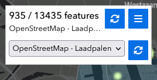
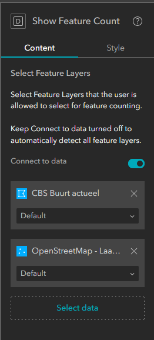

# Experience Builder Feature Counting widget

This ArcGIS Experience Builder widget counts the number of features within the current view.

With this widget I wanted to try layer interaction, waiting for features to be ready, and general design of Experience Builder widgets.

### Screenshots

A screenshot of the widget in use:



And one of the settings panel:



## How to use the sample

Clone the [Experience Builder SDK](https://github.com/esri/arcgis-experience-builder-sdk-resources) and copy this repo to the `client/your-extensions/widgets` folder of your Experience Builder installation.

Then start both the server and the client with an `npm install` + `npm start`

## How it works

The entrypoint of this widget is `src/runtime/widget.tsx` and `src/setting/setting.tsx` for the settings panel.

```js
// The main code that loads the configured Feature Layers
const getFeatureLayersFromDatasources = async (
  useDataSources: UseDataSource[]
) => {
  const mvm = MapViewManager.getInstance();
  const mapViews = mvm.getAllJimuMapViews();
  if (mapViews.length !== 1) {
    console.warn("No map available to search for layers.");
    return [];
  }
  const jMapView = mapViews[0];

  const promiseJLayerViews = useDataSources.map((datasourceDef) => {
    const jLayerView = jMapView.getJimuLayerViewByDataSourceId(
      datasourceDef.dataSourceId
    );

    return jMapView.whenJimuLayerViewLoaded(jLayerView.id);
  });

  const jLayerViews = await Promise.all(promiseJLayerViews);
  const jFeatureLayerViews = jLayerViews.filter(
    (jlv) => jlv.layer.type === "feature"
  ) as JimuFeatureLayerView[];

  const allNotUpdatingPromise = jFeatureLayerViews.map((jLayerView) => {
    return jLayerView.whenCurrentLayerViewNotUpdating();
  });
  await Promise.all(allNotUpdatingPromise);

  return jFeatureLayerViews;
}
```

# Unit Tests

The tests can be run by using the command `npm run test`, all test files are run, and the results are reported back to you in the terminal.
